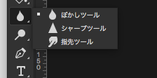
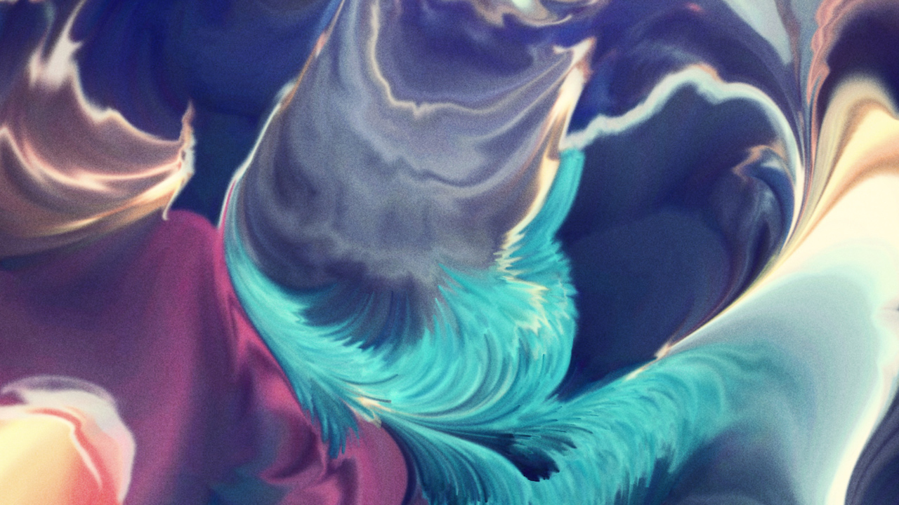
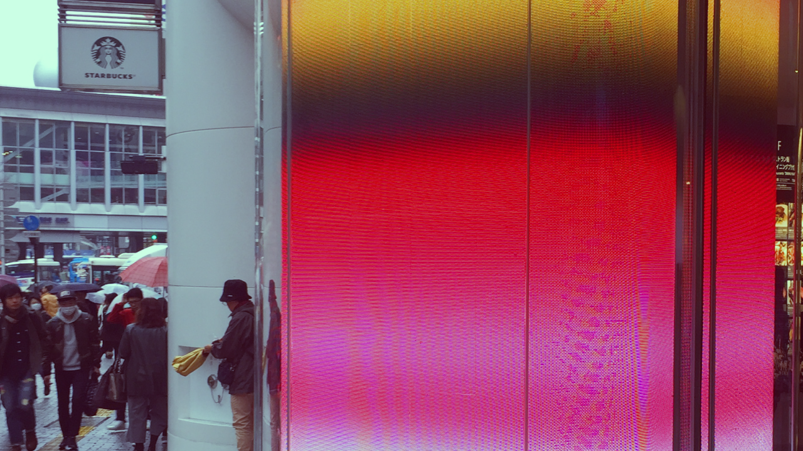
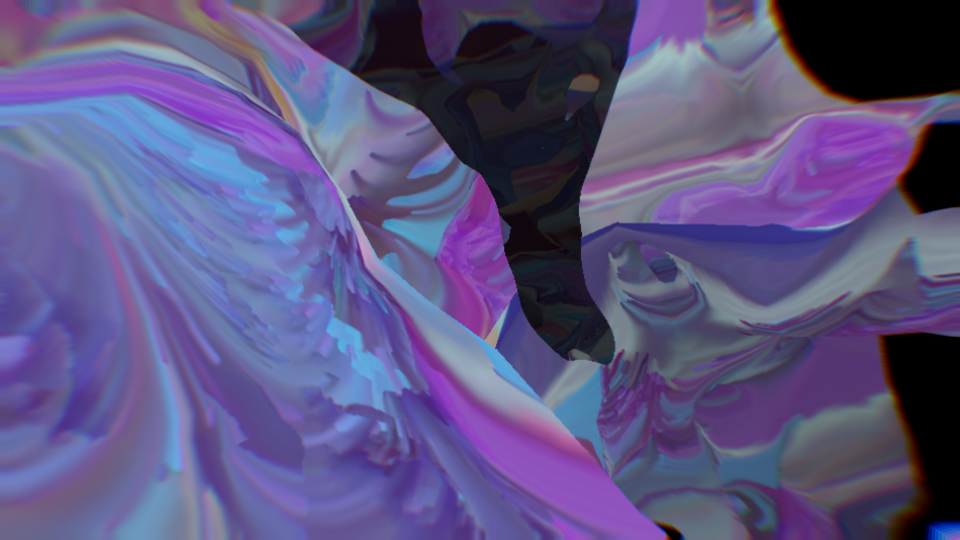
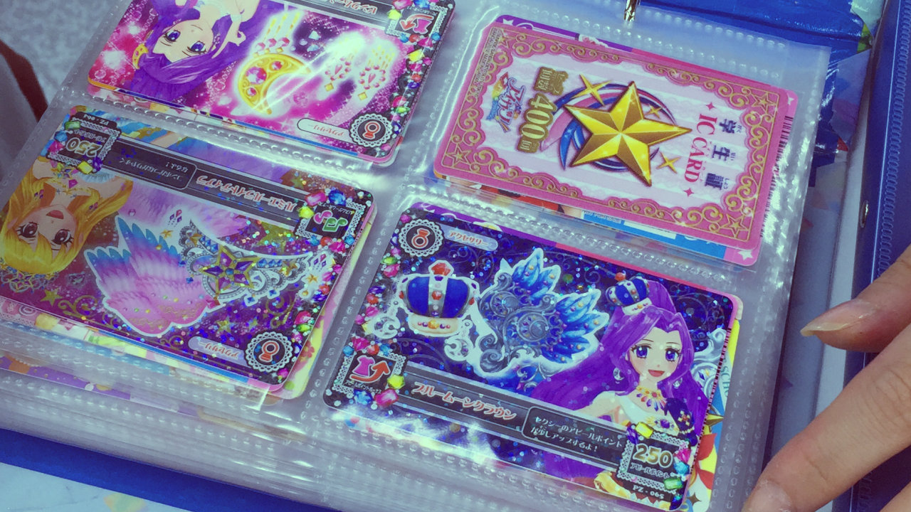

# Feedback Displacement (WIP)

Inspired by Photoshop's smudge tool, this effect displaces pictures and turns them into abstract gradients.

  
  
  

## License

MIT © [Baku Hashimoto](http://baku89.com)
